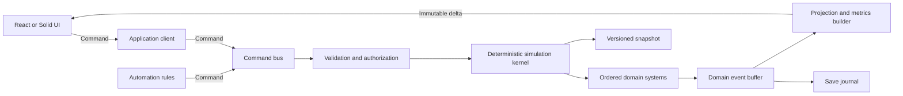
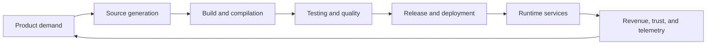

# Code Compiler Empire Architecture

## Architectural goals

Code Compiler Empire is a deterministic, data-driven simulation in which every
layer consumes imperfect output from another layer. Growth comes from improving
the whole production system rather than maximizing one isolated number.

The architecture is built around these constraints:

- The simulation is a headless TypeScript package with no browser or framework
  dependencies.
- Domain systems own their state and communicate through typed resources,
  commands, events, and read-only metrics.
- Simulation results are deterministic for a given save, command stream, game
  version, and elapsed time.
- Large populations are represented as cohorts and flows by default. Individually
  simulated entities are reserved for strategically important objects.
- Content is declarative and schema-validated so new mechanics can be added
  without modifying unrelated systems.
- Save data is versioned independently from UI state and migrated explicitly.

## 1. Core domains

### Simulation kernel

The kernel owns simulation time, phase ordering, command validation, deterministic
randomness, event delivery, and system scheduling. It knows how to run systems
but contains no game-specific formulas.

Each simulation step has ordered phases:

1. Accept and validate player or automation commands.
2. Apply topology and allocation changes.
3. Calculate capacities, demand, and modifiers from the current state.
4. Move work through production systems.
5. Resolve quality, deployment, runtime, and incident outcomes.
6. Accrue economy, research, debt, and organizational effects.
7. Emit events, update derived metrics, and evaluate unlocks.

Systems may write only state they own. Cross-domain effects are expressed as
inputs, outputs, modifiers, or events and become visible at a defined phase
boundary. This makes the apparent cyclic game design execute as an acyclic,
repeatable pipeline.

### Source generation

Turns product demand and engineering capacity into source artifacts.

Responsibilities:

- Feature, maintenance, refactor, and hotfix work queues
- Language, framework, and code-generation pipelines
- Developer and automation throughput
- Code complexity, novelty, and initial defect generation
- Repository topology and reusable library dependencies

Primary outputs are versioned `ArtifactBatch` records containing code volume,
complexity, provenance, compatibility tags, and latent quality distributions.

### Build and compilation

Transforms source artifacts into build artifacts while consuming compute,
toolchain capacity, cache capacity, and time.

Responsibilities:

- Build graph scheduling and critical-path calculation
- Compiler/toolchain compatibility
- Incremental and distributed build caches
- Queue priority, parallelism, and memory/compute contention
- Build failures and diagnostics

Primary outputs are compiled artifact batches, build diagnostics, cache
telemetry, and demand for infrastructure.

### Testing and quality

Evaluates artifacts and produces confidence rather than perfect truth.

Responsibilities:

- Test suites grouped by unit, integration, performance, security, and canary
- Coverage, test relevance, flakiness, and execution cost
- Defect detection, false positives, and escaped-defect probability
- Quality gates and release policy
- Bug triage and remediation queues

Quality is modeled as distributions and evidence. The system never exposes the
exact latent defect count to the player.

### Release, deployment, and runtime

Converts validated builds into running services that serve demand and generate
value.

Responsibilities:

- Release trains, environments, rollout strategies, and rollback
- Service dependency graph and version compatibility
- Runtime compute, storage, network, and observability capacity
- Traffic, latency, reliability, availability, and customer trust
- Incidents, blast radius, mitigation, and recovery

Runtime generates revenue and reputation, but also production telemetry,
incident work, infrastructure demand, and real-world quality evidence.

### Research and knowledge

Converts research capacity and observed evidence into capabilities.

Responsibilities:

- Technology graph and unlock requirements
- Experiments with costs, risks, and uncertain outcomes
- Organizational knowledge, documentation, and knowledge decay
- Toolchain upgrades and adoption progress
- Reusable insights derived from builds, tests, and incidents

Research does not directly mutate other domains. It grants typed capabilities
and modifiers that those domains opt into.

### Technical debt and architecture

Tracks deferred costs and structural coupling rather than a single global debt
number.

Responsibilities:

- Debt items by subsystem, category, severity, and propagation path
- Entropy generated by rushed delivery, incompatibility, and incidents
- Interest paid through slower changes, longer builds, more defects, and
  operational risk
- Refactoring, migration, deprecation, and architectural initiatives
- Dependency graph health and change-amplification effects

Debt is localized. A subsystem can become a bottleneck without globally
penalizing unrelated production.

### Organization and policy

Allocates people, automation, budgets, and authority across the empire.

Responsibilities:

- Teams represented as skill and seniority cohorts
- Hiring, training, attrition, morale, and cognitive load
- Ownership and cross-team coordination
- Budgets, priorities, service-level objectives, and governance
- Policies such as review requirements, test gates, deployment windows, and
  incident escalation

Policies are data-driven constraints and modifiers consumed by other systems.
They trade throughput for quality, safety, knowledge, or cost.

### Economy and demand

Provides the external pressure that makes technical decisions meaningful.

Responsibilities:

- Product demand, contracts, user segments, and service-level expectations
- Revenue, operating cost, capital budgets, and penalties
- Market reputation and demand growth
- Strategic objectives and milestone rewards

Economy owns money and demand. Other domains report usage and outcomes rather
than changing balances directly.

### Automation and control

Lets the player replace manual actions with rules, controllers, and software.

Responsibilities:

- Trigger-condition-action rules
- Priority and allocation policies
- Bounded feedback controllers for capacity and queue management
- Automation cost, reliability, observability, and maintenance
- Conflict detection and execution budgets

Automations issue the same validated commands as the player. They never bypass
domain invariants or mutate state directly.

### Progression and content

Defines technologies, scenarios, milestones, modifiers, tutorials, and balance
data. It references stable domain capabilities but does not implement simulation
logic.

### Persistence and migration

Stores canonical simulation state, command history, metadata, and content
versions. UI selections, animations, and transient panels are stored separately
and are never required to reconstruct the simulation.

### Presentation and application shell

React or Solid consumes immutable projections from the simulation worker and
sends typed commands back. It owns interaction state, rendering, localization,
accessibility, charts, and notifications, but no authoritative game rules.

## 2. Data and control flow

### Runtime control flow



The browser runs the simulation in a Web Worker. The UI exchanges serializable
protocol messages with it:

- `DispatchCommand`: request an authoritative state transition.
- `AdvanceTime`: advance foreground or offline simulation.
- `SubscribeProjection`: select a bounded read model.
- `ProjectionDelta`: publish changed rows and metrics.
- `CommandResult`: report accepted or rejected commands with typed reasons.
- `SaveCheckpoint`: request a durable snapshot.

The UI may optimistically display intent, but only worker results become
authoritative.

### Production flow



Work travels through bounded queues. Each stage exposes throughput, utilization,
wait time, rejection rate, and effective yield. These shared metrics let the
player identify the actual constraint without coupling implementation details.

### Feedback loops

The design intentionally contains feedback loops, but each loop crosses a tick
or event boundary:

| Loop | Forward effect | Return effect |
|---|---|---|
| Delivery growth | More deployments increase features and revenue | Demand and traffic increase runtime and source backlog |
| Quality | More testing reduces escaped defects | Larger suites consume build capacity and can become flaky |
| Incident | Runtime defects create incidents | Incidents consume engineering capacity but produce evidence and knowledge |
| Debt interest | Shortcuts increase immediate throughput | Local complexity increases future source, build, test, and incident costs |
| Refactoring | Refactors consume delivery capacity | Reduced coupling and complexity improve future flow |
| Research | Experiments unlock automation and efficiency | New toolchains create adoption cost, incompatibility, and learning demand |
| Scale | Revenue funds staff and infrastructure | Team size increases coordination load and policy pressure |
| Automation | Rules reduce manual work and stabilize queues | Automation consumes compute, maintenance, and debugging capacity |
| Reliability | Strong operations preserve trust and demand | Higher service expectations increase policy and infrastructure cost |

### Dependency rules

To prevent software-level circular dependencies:

- Domain packages depend only on the kernel contracts, shared value objects, and
  their own state.
- A system reads foreign data through a frozen `SimulationView` or declared
  metric input, never by importing another system's implementation.
- A system writes only its own component tables and appends typed domain events.
- Cross-domain reactions are event handlers scheduled in a later phase.
- Economy is the sole writer of currency; research is the sole writer of
  capabilities; each queue has exactly one owning system.
- Derived values are recomputed or cached in projections and are not duplicated
  as authoritative state.

### Offline progress

Every save stores `simTime`, `wallClockSavedAt`, and a content/version manifest.
On load, elapsed wall time is clamped by scenario rules and advanced through the
same simulation APIs as foreground play.

Offline advancement uses a hybrid strategy:

1. Split elapsed time at scheduled discontinuities such as research completion,
   queue exhaustion, contract deadlines, policy changes, or capacity upgrades.
2. Use exact fixed steps around discontinuities and for small populations.
3. Use rate-based bulk transitions for stable intervals, bounded so no resource
   crosses zero and no queue changes regime inside a chunk.
4. Recalculate rates after every chunk and reduce chunk size when utilization,
   failure probability, or queue ownership changes materially.
5. Produce a compact `OfflineReport` from aggregated events rather than retaining
   every repeated event.

Random outcomes use counter-based streams keyed by
`saveSeed/systemId/entityOrCohortId/eventOrdinal`. Results therefore do not
depend on frame rate, worker scheduling, or iteration order.

### Cascading bottlenecks

All production domains implement a common flow contract:

```ts
interface FlowStage {
  readonly inputQueue: QueueId;
  readonly outputQueue: QueueId;
  estimateCapacity(view: SimulationView, interval: SimDuration): CapacityQuote;
  process(ctx: SystemContext, interval: SimDuration): FlowResult;
}
```

Capacity is calculated from the minimum of infrastructure, labor, dependency,
policy, and input constraints. Unprocessed work remains in bounded queues,
increasing age and urgency. Backpressure can change upstream priorities, while
dropped or rushed work creates explicit debt or quality consequences. No stage
silently discards excess production.

## 3. Key data structures and resource types

All identifiers are branded strings or integers. Content definitions use stable
namespaced string IDs; runtime instances use compact numeric IDs.

```ts
type Brand<T, Name extends string> = T & { readonly __brand: Name };
type EntityId = Brand<number, "EntityId">;
type ContentId = Brand<string, "ContentId">;
type SimTick = Brand<number, "SimTick">;
type Fixed = Brand<number, "FixedPoint">;

interface Quantity<Unit extends string> {
  readonly amount: Fixed;
  readonly unit: Unit;
}
```

Simulation arithmetic uses fixed-point integers for authoritative economic,
probability, and rate calculations. Floating point is allowed only in
presentation projections.

### Canonical state

```ts
interface SimulationState {
  readonly schemaVersion: number;
  readonly gameVersion: string;
  readonly contentHash: string;
  readonly seed: string;
  simTick: SimTick;
  nextEntityId: number;
  domains: DomainStateRegistry;
  scheduler: SchedulerState;
}

interface DomainStateRegistry {
  source: SourceState;
  build: BuildState;
  quality: QualityState;
  runtime: RuntimeState;
  research: ResearchState;
  debt: DebtState;
  organization: OrganizationState;
  economy: EconomyState;
  automation: AutomationState;
}
```

Domain state uses normalized tables and structure-of-arrays storage on hot
paths. References are IDs, not nested object graphs. This minimizes allocations,
supports delta serialization, and makes migrations tractable.

### Work and artifacts

```ts
interface WorkBatch {
  id: EntityId;
  kind: "feature" | "maintenance" | "refactor" | "hotfix" | "research";
  ownerId: EntityId;
  subsystemId: EntityId;
  units: Fixed;
  complexity: Fixed;
  urgency: Fixed;
  createdAt: SimTick;
  traits: readonly ContentId[];
}

interface ArtifactBatch {
  id: EntityId;
  sourceWorkId: EntityId;
  stage: "source" | "compiled" | "tested" | "release" | "deployed";
  version: number;
  quantity: Fixed;
  complexity: Fixed;
  latentQualitySeed: string;
  compatibility: readonly ContentId[];
  provenance: readonly EntityId[];
}

interface FlowQueue {
  id: EntityId;
  capacity: Fixed;
  batches: readonly EntityId[];
  discipline: "fifo" | "priority" | "deadline";
}
```

Batches combine homogeneous work. They split only when routing or outcomes
diverge and merge when all gameplay-relevant dimensions match.

### Capacity, rates, and modifiers

```ts
interface CapacityQuote {
  stageId: EntityId;
  interval: SimDuration;
  maximum: Fixed;
  effective: Fixed;
  constraints: readonly ConstraintContribution[];
}

interface Modifier {
  source: EntityId | ContentId;
  target: ModifierTarget;
  operation: "add" | "multiply" | "cap-min" | "cap-max";
  value: Fixed;
  priority: number;
  expiresAt?: SimTick;
}
```

Modifier stacking has a single documented order: base values, additive changes,
multiplicative changes, then minimum and maximum caps. Modifier provenance is
retained so the UI can explain every displayed number.

### Quality, debt, and incidents

```ts
interface QualityProfile {
  defectRisk: Fixed;
  securityRisk: Fixed;
  performanceRisk: Fixed;
  confidence: Fixed;
  evidenceBySuite: Readonly<Record<ContentId, Fixed>>;
}

interface DebtItem {
  id: EntityId;
  subsystemId: EntityId;
  category: ContentId;
  principal: Fixed;
  interestModel: ContentId;
  couplingEdges: readonly EntityId[];
  discovered: boolean;
}

interface Incident {
  id: EntityId;
  serviceId: EntityId;
  severity: Fixed;
  remainingImpact: Fixed;
  state: "active" | "mitigating" | "monitoring" | "resolved";
  assignedCapacity: Fixed;
  evidenceSeed: string;
}
```

### Organization and infrastructure

```ts
interface TeamCohort {
  id: EntityId;
  headcount: Fixed;
  skills: Readonly<Record<ContentId, Fixed>>;
  morale: Fixed;
  cognitiveLoad: Fixed;
  ownership: readonly EntityId[];
}

interface InfrastructurePool {
  id: EntityId;
  kind: ContentId;
  capacity: Fixed;
  reserved: Fixed;
  efficiency: Fixed;
  operatingCostRate: Fixed;
}

interface PolicyInstance {
  id: EntityId;
  definitionId: ContentId;
  scope: EntityId | "global";
  parameters: Readonly<Record<string, Fixed | boolean | ContentId>>;
}
```

### Commands, events, and projections

```ts
interface GameCommand<T extends string, P> {
  id: string;
  type: T;
  issuedAt: SimTick;
  payload: P;
}

interface DomainEvent<T extends string, P> {
  sequence: number;
  tick: SimTick;
  sourceSystem: ContentId;
  type: T;
  payload: P;
}

interface EmpireProjection {
  revision: number;
  headline: HeadlineMetrics;
  bottlenecks: readonly BottleneckView[];
  queues: readonly QueueView[];
  alerts: readonly AlertView[];
}
```

Commands express intent, events record facts, and projections answer UI queries.
The event stream is useful for diagnostics and summaries but snapshots remain
the primary save format; the game does not require replaying an unbounded event
history.

### Content definitions

Content is immutable at runtime and validated at startup:

```ts
interface ContentPack {
  manifest: ContentManifest;
  technologies: readonly TechnologyDefinition[];
  policies: readonly PolicyDefinition[];
  modifiers: readonly ModifierDefinition[];
  scenarios: readonly ScenarioDefinition[];
  balance: BalanceTables;
}
```

Definitions contain data and references, not executable scripts. Extension
points are registered typed strategies with stable IDs. This preserves save
compatibility, auditability, and deterministic behavior while still allowing
new formulas and mechanics.

## 4. Suggested folder and module structure

The project should use a workspace so simulation, UI, tooling, and content have
enforced package boundaries.

```text
.
├─ apps/
│  └─ web/
│     ├─ src/app/                 # Routing, providers, application shell
│     ├─ src/features/            # UI slices by player-facing feature
│     ├─ src/components/          # Reusable presentational components
│     ├─ src/projections/         # View-model selectors and formatting
│     └─ src/worker/              # Simulation worker client
├─ packages/
│  ├─ protocol/
│  │  └─ src/                     # Serializable command/projection contracts
│  ├─ simulation/
│  │  └─ src/
│  │     ├─ kernel/               # Clock, phases, scheduler, RNG, command bus
│  │     ├─ shared/               # IDs, fixed point, quantities, tables
│  │     ├─ domains/
│  │     │  ├─ source/
│  │     │  ├─ build/
│  │     │  ├─ quality/
│  │     │  ├─ runtime/
│  │     │  ├─ research/
│  │     │  ├─ debt/
│  │     │  ├─ organization/
│  │     │  ├─ economy/
│  │     │  └─ automation/
│  │     ├─ flow/                 # Generic queues, capacity, backpressure
│  │     ├─ progression/          # Unlock and milestone evaluation
│  │     ├─ offline/              # Segmentation and bulk advancement
│  │     ├─ projections/          # Simulation-owned read-model builders
│  │     └─ diagnostics/          # Invariants, traces, balance telemetry
│  ├─ content/
│  │  ├─ src/schema/              # Runtime schemas and generated TS types
│  │  ├─ src/packs/core/          # Technologies, policies, scenarios, balance
│  │  └─ src/registry/             # Strategy and content registration
│  ├─ persistence/
│  │  └─ src/
│  │     ├─ codec/                # Compact snapshot encoding
│  │     ├─ migrations/           # Sequential schema migrations
│  │     ├─ repository/           # IndexedDB and import/export boundaries
│  │     └─ recovery/             # Checkpoints and corruption handling
│  └─ test-support/
│     └─ src/                     # Scenario builders, deterministic fixtures
├─ tools/
│  ├─ content-validator/          # IDs, references, schemas, graph checks
│  ├─ balance-runner/             # Headless long-horizon simulations
│  └─ save-inspector/             # Migration and state diagnostics
└─ tests/
   ├─ integration/                # Cross-domain feedback-loop scenarios
   ├─ determinism/                # Replay and chunk-equivalence tests
   ├─ performance/                # Population and offline budgets
   └─ golden/                     # Versioned scenario outcomes
```

Each domain follows the same internal shape:

```text
domain/
├─ state.ts                       # Canonical owned state
├─ commands.ts                    # Intent and validation
├─ events.ts                      # Facts emitted and consumed
├─ system.ts                      # Phase implementation
├─ selectors.ts                   # Read-only domain queries
├─ strategies.ts                  # Registered formula extension points
├─ content.ts                     # Definitions owned by this domain
└─ index.ts                       # Explicit public API
```

Package export maps and lint rules should prohibit deep imports and imports
between domain implementations. Only each domain's `index.ts` contract is
public.

### Implemented layer modules

The simulation package currently exposes nine `SimulationLayer` modules under
`src/layers`. Each module publishes pipeline metadata, systems, command and
event handlers, feedback-loop descriptions, and performance notes; its internal
state is owned by its systems and is not imported by downstream layers.

| Module | Shared inputs | Shared outputs | Scaling model |
|---|---|---|---|
| Organization & Policy | Money, Knowledge | Human/AI/Maintenance capacity, Policy strength | Team skill cohorts |
| Source Generation | Capacities, Compute, Knowledge, Policy | Source, Debt, Insight | Aggregate human/AI throughput |
| Build & Compilation | Source, Compute, Debt, Policy, Knowledge | Binaries, Bugs, Debt, Insight | Precompiled build DAG and artifact batches |
| Testing & Verification | Binaries, Bugs, Compute, Policy | Releases, Confidence, Insight | Test-suite cohorts |
| Runtime & Deployment | Releases, Bugs, Confidence, Reputation | Money, Incidents, Insight, Reputation | Service cohorts |
| Knowledge & Research | Insight, Money, runtime events | Knowledge | One active project over immutable graph data |
| Technical Debt & Maintenance | Debt, Maintenance capacity, Money, Knowledge | Reduced Debt, Bugs, Insight | Debt-category cohorts |
| Self-Improving Automation | Runtime evidence, Knowledge, Policy, Autonomy, Morale | Source, Automation power, Hot-deploy requests, Debt, Instability | Aggregate recursive controller |
| Crisis Detection & Response | Incidents, Debt, Instability, Morale, Money | Containment, emergency remediation, crisis telemetry | Thresholded crisis cohorts |

Cross-layer dependencies are expressed through resource IDs, event names, and
pipeline/system IDs. The default composition is created by
`createCoreSimulationModules()`; custom games can compose different layer
instances with `composeLayers()`.

Layer and system IDs live in the neutral `layers/ids.ts` catalog. Domain modules
therefore do not import one another to establish scheduler dependencies.
Research, build, and pipeline graphs all use cycle-checked topological
validation.

Artifact quantities remain shared resources for fast capacity calculations,
while bounded cohorts carry provenance, originating team policy, and risk
through Source → Build → Test → Runtime. Each consumer asserts scalar/cohort
quantity conservation. Late automation output is transferred by a persisted
next-tick cohort event. Adjacent compatible cohorts merge; forced compaction
uses quantity-weighted metadata so confidence and risk are conserved.
Technical debt similarly retains category principal so interest and
maintenance efficiency remain localized.

Tick atomicity uses a reversible mutation journal: touched resource balances,
replaced system states, consumed commands, and event queue boundaries are
recorded as deltas. Failed ticks replay inverse deltas rather than cloning the
entire world before every tick.

Events have explicit delivery semantics. Same-tick events are visible to later
phases, next-tick events cross a phase boundary once, and durable events remain
in snapshots until an eligible consumer acknowledges their sequence IDs. All
queues participate in tick rollback and bounded-capacity validation.

Offline progression remains exact while the empire is active. When a completed
tick proves the state quiescent, the kernel advances directly to the next
scheduled command or horizon. Stable active flows can register an
`AnalyticalOfflineModel` that returns closed-form resource mutations, system
state patches, event multiplicities, and consumed event-sequence count. Models
cannot cross commands or queued events; unsupported states fall back to exact
ticks. `createFixedRateAnalyticalModel()` covers deterministic linear flows and
counter accumulation without domain-specific boilerplate.

Analytical models declare complete system, resource, and event coverage. The
kernel accepts a model only when those sets match the configured execution
graph, preventing a bulk formula from skipping an unmodeled feedback layer.
Endpoint invariants run after a transactional batch; failure rolls resource,
state, tick, and event-sequence changes back before exact stepping resumes.
Offline reports expose exact and analytical tick counts separately.

Offline progress processes the complete elapsed interval by default. Games that
intentionally impose a reward cap select the explicit truncate policy, which
reports discarded ticks and consumes fractional elapsed time so repeated loads
cannot replay it.

### Save evolution and data-driven tuning

Persistent saves use a versioned envelope around the simulation snapshot. A
canonical checksum is verified before parsing authoritative state. Sequential
migrations upgrade legacy schema versions, including event-queue delivery
metadata and durable queues, before the normal configuration/content
compatibility checks run.

The default economy is a versioned `CoreBalanceConfig` containing organization,
hardware, build graph, test suite, service, research, debt, automation, and
crisis data. The JSON parser rejects missing sections, unsafe or negative
numbers, and out-of-range permille values. Layer composition consumes this data
directly; formulas remain code, while coefficients and content graphs can be
tuned independently. Domain-level semantic validation also runs for
programmatic configs, including non-empty collections, unique IDs, divisors,
capacities, selected content, and permille ranges. Core configuration derives
its content hash directly from canonical balance data.

### Observability projections

The headless engine exposes read-only projection data rather than UI models:

- debt heatmaps include category principal, share, interest pressure, and
  maintenance efficiency;
- pipeline visualization includes pipeline/system nodes, dependency edges,
  phases, resource access, and event contracts;
- productivity projections include funded team capacity, persistent morale,
  local policy, funded swarm count, effective alignment/capacity, and cumulative
  human-versus-agent output.
- a bounded sampled execution window aggregates active, blocked, and idle ticks,
  throughput, resource flow, emitted events, and explicit bottleneck reasons.

These projections are derived from authoritative state and contain only
JSON-compatible values, so React, Solid, developer consoles, telemetry, and
save inspectors can consume the same contracts.

Events are indexed by type once per tick. State patches deep-freeze only new
subtrees and reuse already-frozen state, while quiescence uses the mutation
journal instead of serializing entire states for comparison.

Agent populations are modeled as swarms with autonomy, alignment, productivity,
and operating cost. Human teams carry morale and skill trees for source
generation, verification, operations, and research. Global policy supplies defaults, while funded team policy is weighted into
shared controls and embedded into each source cohort. Those local controls
therefore survive compilation, verification, and deployment rather than
collapsing into a global average. Team morale is persistent and changes with
payroll coverage, standards, risk, instability, crises, training, and recovery.
Global policy also controls
coding standards, risk tolerance, release cadence, AI allocation, testing, and
maintenance; team policy overrides can trade local throughput against morale
and safety.

The recursive automation controller runs after runtime and research. It converts
deployment evidence and knowledge into automation power, emits new source for
the next build cycle, and queues hot-deploy requests. Safe policies damp this
loop. High autonomy and risk with weak standards create a positive feedback
loop across automation power, generated source, debt, incidents, instability,
and crisis severity. Hot-deploy requests are bounded; overflow produces debt
instead of an unbounded queue. The crisis layer opens one lifecycle episode per
active outage, debt explosion, or rebellion. Resolution consumes both money and
organization-provided response capacity; contained episodes cannot reopen until
their triggering condition clears.

### AI-assisted expansion workflow

New content and systems are easier to generate safely when contracts are
machine-checkable:

1. JSON or TypeScript content schemas validate IDs, references, units, ranges,
   and graph acyclicity.
2. A domain template supplies the standard files and registration points.
3. Exhaustive discriminated unions make unhandled commands and events fail the
   type check.
4. Dependency rules fail CI on cross-domain implementation imports.
5. Every mechanic includes invariants, a deterministic scenario fixture, and a
   balance-runner case.
6. Generated API documentation lists ownership, inputs, outputs, events, and
   modifier targets for each system.

This gives an AI agent narrow, discoverable change surfaces and immediate
feedback when a generated change violates architectural boundaries.

## 5. Major risks and mitigations

| Risk | Failure mode | Mitigation |
|---|---|---|
| Circular domain dependencies | Systems directly call each other and tick order becomes accidental | Single-writer ownership, frozen views, typed events, declared phases, import-boundary linting |
| Unstable feedback loops | Positive loops explode or oscillate, making saves unrecoverable | Bounded rates, explicit caps, damped controllers, queue backpressure, scenario stress tests |
| High entity counts | Per-person or per-file objects cause long ticks and garbage collection | Cohorts, artifact batches, normalized tables, structure-of-arrays hot storage, merge/split rules |
| Offline simulation cost | Hours offline require millions of foreground ticks | Discontinuity scheduler, adaptive bulk transitions, bounded exact windows, aggregated reports |
| Foreground/offline divergence | Chunking changes outcomes or enables exploits | Shared transition kernels, counter-based RNG, chunk-equivalence tests, conservative chunk boundaries |
| State explosion | Every combination of tool, policy, skill, and subsystem becomes bespoke state | Orthogonal dimensions, sparse components, tags, generic modifiers, computed projections |
| Modifier opacity | Players and developers cannot explain a calculated value | Deterministic stacking order and retained provenance for every modifier |
| Save incompatibility | Refactors or content changes invalidate long-running empires | Versioned snapshots, sequential pure migrations, stable content IDs, compatibility fixtures |
| Event-log growth | Repeated idle events consume memory and save space | Per-tick event buffer, bounded diagnostic journal, aggregation, snapshots as canonical persistence |
| UI coupling | Rendering cadence or framework state changes game outcomes | Worker-hosted headless simulation, serializable protocol, immutable projections |
| Balance regressions | A small formula change breaks late-game progression | Seeded long-horizon simulations, golden milestones, telemetry percentiles, explicit balance budgets |
| Automation runaway | Rules fight each other or issue unbounded commands | Per-tick execution budget, cooldowns, deterministic priority, conflict diagnostics, loop detection |
| Numerical drift | Floating-point accumulation changes long-running saves | Fixed-point authoritative arithmetic, checked overflow, unit-aware quantities |
| Content/plugin nondeterminism | Arbitrary scripts mutate state or depend on wall time | Declarative content only; typed, registered, deterministic strategy functions |
| Excessive fidelity | Rich mechanics make every tick prohibitively expensive | Fidelity tiers: strategic entities, cohorts for populations, rates for stable flows |
| Worker message pressure | Full-state copies stall the UI | Revisioned projection deltas, transfer-friendly arrays, bounded subscriptions, throttled visual updates |

## Architectural validation gates

Before a feature is considered complete, the architecture expects:

- The same seed and command stream produce byte-equivalent canonical state.
- Advancing an eligible stable interval in chunks produces the same bounded
  result as exact stepping.
- Resource quantities remain finite and non-negative unless their type explicitly
  permits debt.
- Every queue item has one owner and every currency mutation has a recorded
  reason.
- Save migration fixtures load from every supported schema version.
- Performance tests cover representative early, late, and pathological empires.
- UI integration tests prove that reload, backgrounding, and worker restart do
  not duplicate commands or progress.

These gates protect the feedback-heavy design while allowing individual domains,
content packs, and presentation features to evolve independently.
